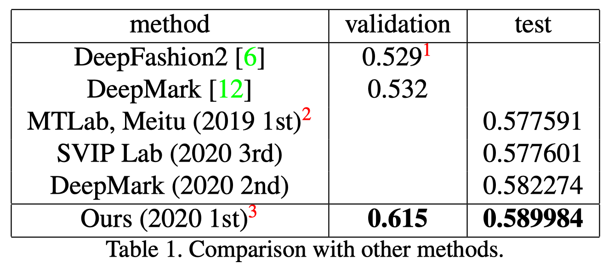

# Aggregation and Finetuning for Clothes Landmark Detection

**This is a code repo of https://github.com/lzhbrian/deepfashion2-kps-agg-finetune**. But the original repo said the "__[WIP] Code release is still in preparation, stay tuned.__" Thus, this repo fix some problems in the original repo and can be ran . More details can be found in the orginal repo.


__1st place solution__ for [__CVPR 2020 DeepFashion2 Clothes Landmark Detection Track__](https://competitions.codalab.org/competitions/22966). 

This repo contains code for the keypoints detector on [**Deepfashion2**](https://github.com/switchablenorms/DeepFashion2). (The object detection part is not contained.)



**In summary, this repo uses HRNet to detect the lankmarks of different clothes.**

## Prerequisite

### Install

* install HRNet dependencies as in [HRNet/HRNet-Human-Pose-Estimation](https://github.com/HRNet/HRNet-Human-Pose-Estimation)
    ```
    cd HRNet-Human-Pose-Estimation/lib
    pip install -r requirements.txt
    ```

    then install nms dependencies

    ```
    cd HRNet-Human-Pose-Estimation/lib
    make
    ```

* install cocoapi in [switchablenorms/DeepFashion2](https://github.com/switchablenorms/DeepFashion2)

    ```bash
    git clone https://github.com/switchablenorms/DeepFashion2
    cd DeepFashion2/deepfashion2_api/PythonAPI/
    make install
    ```


### Data preprocess

* download data to `HRNet-Human-Pose-Estimation/data/` or any place you want. You just need to change the corresponding location in your experiment config file, ie., the config files in `HRNet-Human-Pose-Estimation/experiments/`.

* Aggregate 294 lankmarks to 81 landmarks, according to similar positions. It receives `train_coco.json` and convert it to `train_coco_agg81kps.json`. (If you need to finetune on each category, you should do the same convertion.)
    ```python
    python scripts/dataset_agg81kps.py # But you need to change the location of infile and outfile.
    ```

* preprocess data to following structure

    ```bash
    data/deepfashion2/
    	annotations/ # original data, converted from deepfashion2_to_coco.py
    		train_coco.json
    		validation_coco.json
    		test_coco.json
    	annotations_agg81kps/ # for training in aggregation
    		train_coco_agg81kps.json
    	annotations_per_category/ # for validation in finetuning
    		validation_coco_category_1.json
    		...
    		validation_coco_category_13.json
    	annotations_per_category_agg81kps/ # for training in finetuning
    		train_coco_category_1.json
    		...
    		train_coco_category_13.json
    	images/ # images, make some symlinks (or just cp) for this to be done
    		train/
    		validation/
    		test/
    ```

* COCO pretrained weights is downloaded from [here](https://github.com/HRNet/HRNet-Human-Pose-Estimation) to `HRNet-Human-Pose-Estimation/models/pytorch/pose_coco/pose_hrnet_w48_384x288.pth`


## Usage

### Training
Deepfashion2 has gt bounding box annotations for clothes.
* Traing under aggregation 81 keypoints

    ```bash
    python tools/train.py --cfg experiments/deepfashion2/w48_512x384_adam_lr1e-3-agg81kps.yaml
    ```

* Finetune on each category (13 categories in total)

    ```bash
    # finetuning 1st category
    python tools/train.py --cfg experiments/deepfashion2/w48_512x384_adam_lr1e-3-agg81kps-category1-hflip.yaml
    # finetuning 2nd category
    python tools/train.py --cfg experiments/deepfashion2/w48_512x384_adam_lr1e-3-agg81kps-category2-hflip.yaml
    # finetuning others ...
    ```
​    
### Testing

* Testing on validation set (with gt det)

    ```bash
    CUDA_VISIBLE_DEVICES=0,1,2,3 python tools/test.py \
        --cfg experiments/deepfashion2/w48_512x384_adam_lr1e-3-agg81kps-category1-hflip.yaml \
    GPUS '(0,1,2,3)' \
        TEST.MODEL_FILE output/deepfashion2agg81kps/pose_hrnet/w48_512x384_adam_lr1e-3-agg81kps-category1-hflip/final_state.pth \
        TEST.USE_GT_BBOX True \
        TEST.IMAGE_THRE 0.01 \
        DATASET.TEST_SET validation \
        TEST.FLIP_TEST True
    ```
    
* Testing  on validation set (with object det results `/path/to/det.json`)

    ```bash
    CUDA_VISIBLE_DEVICES=0,1,2,3 python tools/test.py \
        --cfg experiments/deepfashion2/w48_512x384_adam_lr1e-3-agg81kps-category1-hflip.yaml \
    GPUS '(0,1,2,3)' \
        TEST.MODEL_FILE output/deepfashion2agg81kps/pose_hrnet/w48_512x384_adam_lr1e-3-agg81kps-category1-hflip/final_state.pth \
        TEST.USE_GT_BBOX False \ # Use your detection bounding box
        TEST.COCO_BBOX_FILE '/path/to/det.json' \ 
        TEST.IMAGE_THRE 0.01 \
        DATASET.TEST_SET validation \
        TEST.FLIP_TEST True
    ...
    ```
* I provide the [pretrained model](https://1drv.ms/u/s!Av2b0BEYRpRSpQC4vXEsMf2MkQwZ?e=LXY2XZ). You can download it and put it anywhere you want, but you need to change the config file or code in `train.py, test.py`.

- Test with your own data. (In `inference_test.py`, I delete the logger and some useless code part.)

    **Note**: cloth landmark detection needs cloth bbox, I use [RobustVideoMatting](https://github.com/PeterL1n/RobustVideoMatting) to get mask of human and get the smallest bbox out of this mask. Hence, you can choose Yolo or any object detector to obtain that bbox, and meanwhile change the code in the `dataset/inferenceDataset.py` in `__getitem__()` to load bbox.  
    Then

    ```bash
    python tools/inference_test.py
    ```

## Note
- When I re-implement this repo, I find a confict between packages. Thus I **comment the evalution code**, which would cause some error. But this would not affect the training process.
- The organization of this repo is a little bit messy, including the path. Hence, you might need to adjust by yourself, which is not difficult I think.

## Reference

[HRNet/HRNet-Human-Pose-Estimation](https://github.com/HRNet/HRNet-Human-Pose-Estimation)

Please cite following if you use the code

```tex
@misc{lin2020aggregation,
    title={Aggregation and Finetuning for Clothes Landmark Detection},
    author={Tzu-Heng Lin},
    year={2020},
    eprint={2005.00419},
    archivePrefix={arXiv},
    primaryClass={cs.CV}
}
```


## License

MIT